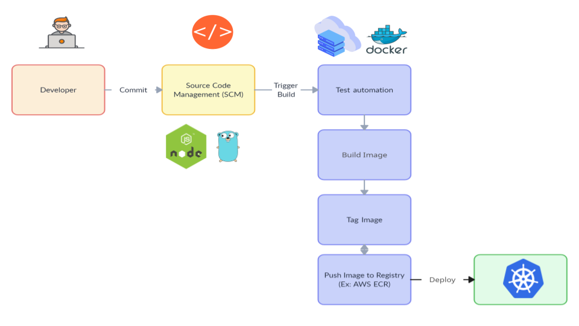

# Web Service CI/CD with GitLab

This repository contains two simple web services:

1. `nodejs-web-app`: A Node.js-based web service.
2. `go-web-app`: A Go-based web service.

This case present a CI/CD pipeline using GitLab that automates the build, test, and deployment processes for these services.

Here's the high level view of the workflow diagram:



## Web Services

### Node.js Web App

The `nodejs-web-app` is a simple web application built using Node.js. It exposes an endpoint at `/mynode`.

### Go Web App

The `go-web-app` is a simple web application built using Go. It exposes an endpoint at `/mygo`.

## CI/CD Flow

### Webhook Setup

Set up a webhook in the service repositories so that any commits to the repository trigger GitLab jobs. For example, any commit to `dev` or `main` branch will trigger a gitlab job.

### GitLab CI/CD Pipeline

Gitlab will utilize a provided machine as it's runner, such as a local machine or a private cloud. The CI/CD pipeline will then run by the defined `.gitlab-ci.yml` file in each service repository. It consists of the following stages:

1. **Build Test (`build-test`):** This job runs the test cases defined in the service's Makefile to ensure that the application functions correctly, and then build the image.

2. **Build and Push (`push`):** On this stage, built Docker image of the service will be pushed to a specified container registry, in this case we're using AWS ECR, all creds should be exported on the gitlab variable.

3. **Deploy (`deploy`):** This job deploys the service to a Kubernetes cluster using the Helm package manager, kubeconfig should be provided for this purpose. This will ensures that the service is manageable and runs in the cluster.

## Usage

To use the CI/CD pipeline, follow these steps:

1. **Commit:** Make a commit to the service repository. This will trigger the CI/CD pipeline based on the commit branch.

2. **Build Test:** The pipeline will start with the "build-test" job, which will execute the test cases defined in the service's Makefile, and depend on the source branch, will build the image if test cases are passed.

3. **Push:** This job will push the docker image to AWS ECR based on provided AWS credentials.

4. **Deploy:** Finally, the "deploy" job will use Helm to deploy the service to a Kubernetes cluster, make sure to configure the Helm manifest accordingly.

Additionally, the pipeline could be further improved by providing image-scan, job report for each stage, chain pipeline,  and many more depending on business needs.

## Live preview

For simple live preview, here is both services that deployed as docker container on my personal site that uses an EC2 instance where the image is stored pulled from ECR:

```
curl service.generalia.tech:3000/mynode
curl service.generalia.tech:8080/mygo
```